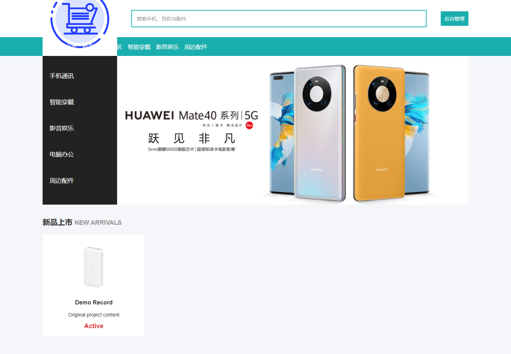
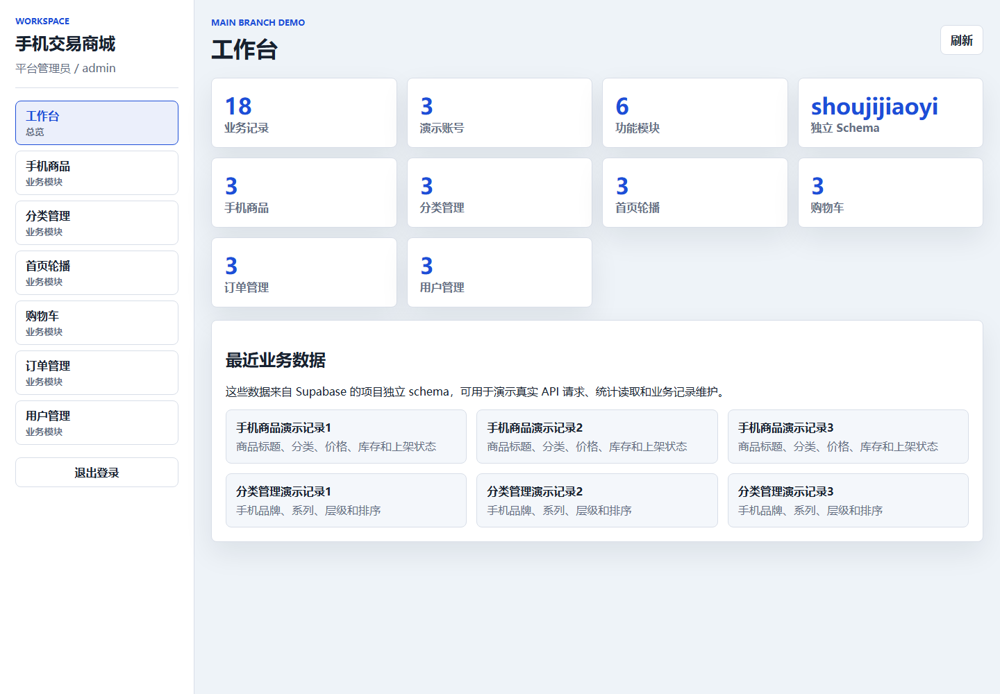
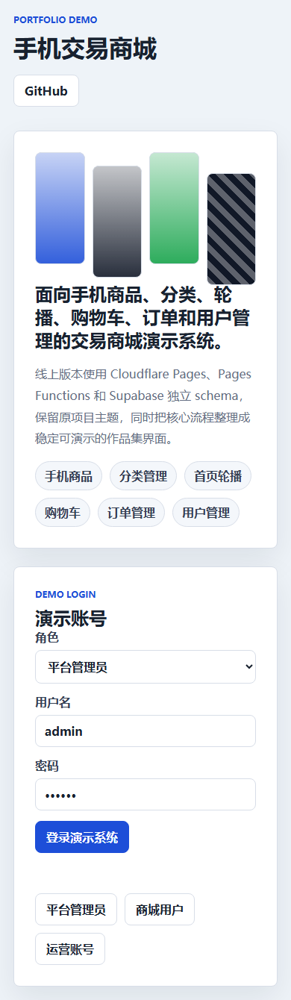

# 新蜂手机商城

    

## 在线演示

- Demo: https://ot-shoujijiaoyi.pages.dev
- GitHub: https://github.com/Nemo-netone/ot-shoujijiaoyi
- 管理员：`admin` / `123456`
- 商城用户：`17759573851` / `123456`
- 店铺运营：`newbee-admin1` / `123456`

## 原前端恢复

本仓库保留原始项目源码，并在 `original-site/` 中提供可直接部署的恢复版前端。恢复版延续原 NewBee Mall 商城与管理后台视觉资源，`site/` 仅作为历史兜底，不作为线上主页面。

恢复版接入同源 Pages Worker API，商品管理使用真实 `product` 数据模块，支持演示登录、非空商品列表，以及商品新增、编辑和删除。数据使用项目独立 Supabase schema。

## 验证记录

2026-07-12 已完成稳定域名、健康检查、三类演示账号登录、`product` 商品列表、临时商品新增/更新/删除与清理，以及桌面和移动端 Playwright 验证。





## 本地预览

```bash
npx wrangler@3 pages dev original-site
```

## 许可

采用 PolyForm Noncommercial 1.0.0。允许非商业使用与修改；商业使用需另行获得作者许可。